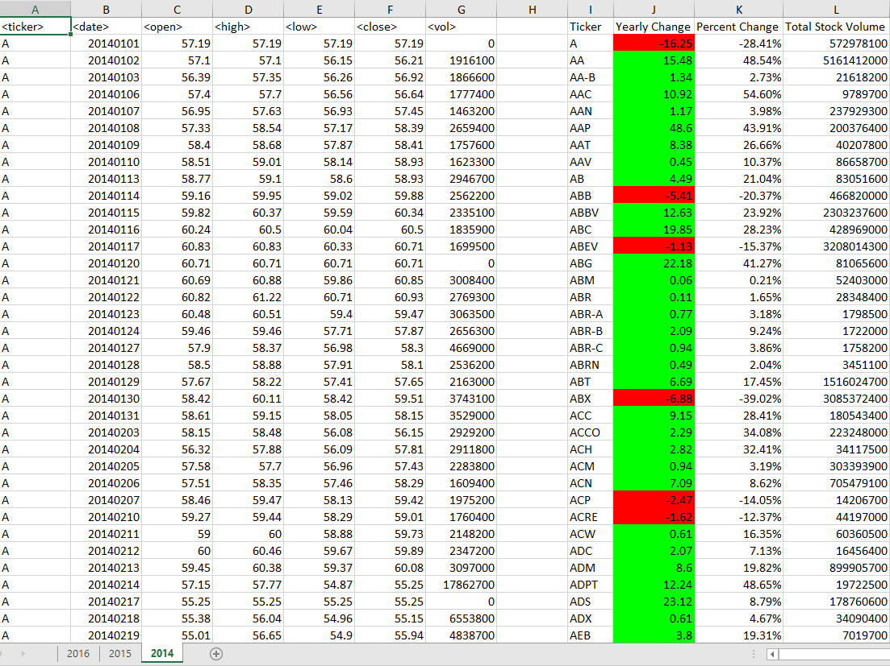
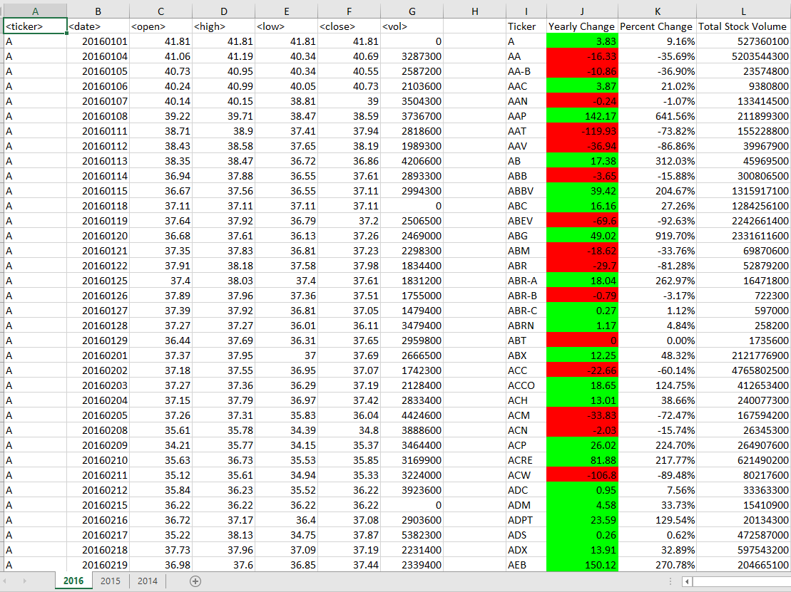

  

## Summary

I will use VBA scripting to analyze stock market data using this [test data](Resources/alphabetical_testing.xlsx) while developing my scripts and this [stock data](Resources/Multiple_year_stock_data.xlsx) to run my scripts to generate the final report.

### Retrival of Data, Column Creation and Conditional Formatting

  

I created a script that looped through all the stocks for one year and output the following:

  * The ticker symbol.
  * Yearly change from opening price at the beginning of a given year to the closing price at the end of that year.
  * The percent change from opening price at the beginning of a given year to the closing price at the end of that year.
  * The total stock volume of the stock.

I also utilized conditional formatting that will highlight positive yearly changes in green and negative yearly changes in red by creating a VBA script that ran on every worksheet just by running the VBA script once.

* These are the results.

  - - -

Contact Information:
* [LinkedIn](https://www.linkedin.com/in/DConnellyII)
* [E-mail]Darryl.Connelly.II@gmail.com
